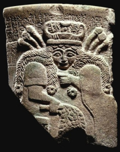

[](https://github.com/google-research/nisaba/blob/main/LICENSE)
[](https://www.aclweb.org/anthology/2021.eacl-demos.3/)
[](https://github.com/google-research/nisaba/actions?query=workflow%3A%22linux%22)
[](https://github.com/google-research/nisaba/actions?query=workflow%3A%22macos%22)

# Nisaba

Named after Nisaba — the Sumerian goddess of writing and scribe of the gods
(𒀭𒉀).



## About

Collection of finite-state transducer-based (FST) tools for visual
normalization, well-formedness, transliteration and NFC normalization of various
scripts from South Asia and beyond. Nisaba provides these APIs in Python and
C++. Currently supported script families:

*   Brahmic scripts (detailed [documentation](nisaba/scripts/brahmic/README.md)).

Nisaba primarily relies on [OpenGrm Pynini](http://pynini.opengrm.org/), which
is a Python toolkit for finite-state grammar development. OpenGrm Pynini, like
its C++ counterpart [Thrax](http://thrax.opengrm.org/), compiles grammars
expressed as strings, regular expressions, and context-dependent rewrite rules
into
[weighted finite-state transducers](http://www.cs.nyu.edu/~mohri/pub/fla.pdf)
(WFSTs). It uses the [OpenFst](http://openfst.org) library and its Python
extension to create, access and manipulate compiled grammars.

## Building and testing

This library will build on any system that supports
[Bazel](https://bazel.build/) versatile multiplatform build and test tool. The
following examples assume [Debian](https://www.debian.org/) Linux distribution,
but should also apply with minor modifications to other Linux and non-Linux
platforms that Bazel supports.

### Prerequisites

Nisaba requires a modern C++ compiler that supports C++17 standard (e.g., the
[GCC 10](https://gcc.gnu.org/gcc-10/) release series) and Python3. Assuming
these are already present, the required dependencies are the Python3 development
headers and the Python3 package installer [pip](https://pip.pypa.io/en/stable/).

```shell
sudo apt-get install bazel
sudo apt-get install python3-dev
sudo apt-get install python3-pip
```

Example Debian configuration: gcc (10.2.0), bazel (3.7.2), python3 (3.8.6) and
pip (20.1.1).

### Getting and building the code

1.  Locally, make sure you are in some sort of a virtual environment (`venv`,
    `virtualenv`, `conda`, etc).

2.  Clone the repository (please note, this example does not clone the fork of
    the main repository, but a forked repo can be used as well):

    ```shell
    git clone https://github.com/google-research/nisaba.git
    cd nisaba
    ```

3.  Build all the targets using Bazel (this example uses optimized mode):

    ```shell
    bazel build -c opt ...
    ```

    The above command will build Nisaba artifacts using all the remote
    repository dependencies, including OpenFst, Pynin and Thrax, that are
    specified in the Bazel [WORKSPACE](WORKSPACE.bazel) file. The resulting
    artifacts are located in `bazel-bin/nisaba` directory.

    If the above command fails due to missing Python prerequisites, please
    install them using `pip` Python package manager and try again:

    ```shell
    pip3 install --upgrade pip
    pip3 install -r requirements.txt
    ```

4.  Make sure the small unit tests are passing:

    ```shell
    bazel test -c opt --test_size_filters=-large,-enormous ...
    ```

    The above command should produce something along the following lines:

    ```shell
      ...
      //nisaba/scripts/brahmic:cc_test                                                 PASSED in 0.4s
      //nisaba/scripts/brahmic:far_cc_test                                             PASSED in 0.2s
      //nisaba/scripts/brahmic:far_test                                                PASSED in 2.0s
      //nisaba/scripts/brahmic:fixed_test                                              PASSED in 0.2s
      //nisaba/scripts/brahmic:fst_properties_test                                     PASSED in 2.3s
      //nisaba/scripts/brahmic:iso_test                                                PASSED in 0.3s
      //nisaba/scripts/brahmic:nfc_test                                                PASSED in 0.2s
      //nisaba/scripts/brahmic:nfc_utf8_test                                           PASSED in 0.2s
      //nisaba/scripts/brahmic:py_test                                                 PASSED in 2.1s
      //nisaba/scripts/brahmic:util_test                                               PASSED in 1.9s
      //nisaba/scripts/brahmic:visual_norm_test                                        PASSED in 0.3s
      //nisaba/scripts/brahmic:visual_norm_utf8_test                                   PASSED in 0.3s
      //nisaba/scripts/brahmic:wellformed_test                                         PASSED in 0.2s
      //nisaba/scripts/brahmic:wellformed_utf8_test                                    PASSED in 0.2s
      ...
    ```

    You may also want to run *all* the tests, but depending on your host
    configuration these may take a long time:

    ```shell
    bazel test -c opt ...
    ```

## Contributions

NOTE: We don't accept pull requests (PRs) at the moment.

## License

Nisaba is licensed under the terms of the Apache license. See [LICENSE](LICENSE)
for more information.

## Citation

If you use this software in a publication, please cite the accompanying
[paper](https://www.aclweb.org/anthology/2021.eacl-demos.3.pdf) from
[EACL 2021](https://2021.eacl.org/):

```bibtex
@inproceedings{nisaba-eacl2021,
    title = {Finite-state script normalization and processing utilities: The {N}isaba {B}rahmic library},
    author = {Cibu Johny and Lawrence Wolf-Sonkin and Alexander Gutkin and Brian Roark},
    booktitle = {16th Conference of the European Chapter of the Association for Computational Linguistics (EACL 2021): System Demonstrations},
    address = {[Online], Kyiv, Ukraine},
    month = apr,
    year = {2021},
    pages = {14--23},
    publisher = {Association for Computational Linguistics},
    url = {https://www.aclweb.org/anthology/2021.eacl-demos.3},
}
```

## Mandatory disclaimer

This is not an official Google product.
